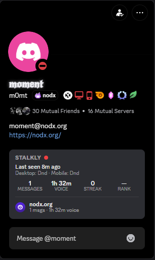
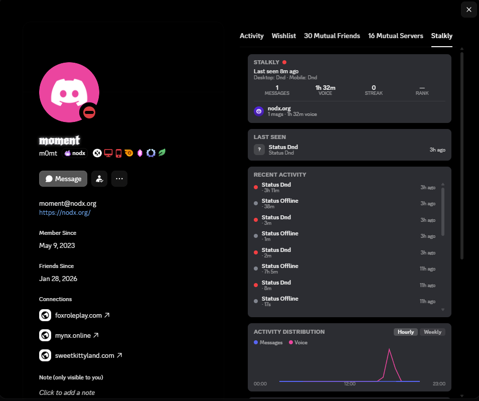

# StalklyProfile

A [Vencord](https://vencord.dev) userplugin that brings your [Stalkly](https://stalkly.me) stats — messages, voice time, level, streak, rank, activity distribution, top contacts, and recent activity — straight into Discord's own profile UI.

No separate app, no switching tabs to a browser: it renders inside the profile popout, the DM sidebar, and gets its own **Stalkly** tab in the full profile modal.

<p align="center">
  
  &nbsp;&nbsp;
  
</p>

<p align="center"><sub>Left: profile popout card &nbsp;·&nbsp; Right: dedicated Stalkly tab in the full profile modal</sub></p>

---

## ✨ Features

| Where | What you see |
|---|---|
| **Profile popout / DM sidebar** | Message & voice totals, streak, rank, badges, last-seen, per-device status, per-server breakdown |
| **Stalkly tab — Last Seen & Activity** | Most recent event + a scrollable timeline of joins, leaves, moves, mutes, status changes |
| **Stalkly tab — Activity Distribution** | Messages vs. voice, toggleable Hourly / Weekly chart |
| **Stalkly tab — Voice** | Top voice channels and most frequent voice contacts |
| **Stalkly tab — Messages** | Top text channels and most frequent reply contacts |

Everything is scoped automatically: card colors and layout stay readable regardless of the server's custom profile theme, and stats can be scoped to just the server you're currently viewing.

---

## 📋 Requirements

These are [Vencord](https://github.com/Vendicated/Vencord)'s own requirements — the install script checks for all three and tells you exactly what's missing.

| Requirement | Version | Notes |
|---|---|---|
| [Git](https://git-scm.com/downloads) | any recent | used to clone/update Vencord |
| [Node.js](https://nodejs.org) | **LTS** | JavaScript runtime |
| [pnpm](https://pnpm.io) | any recent | install with `npm install -g pnpm` |
| Discord | stable branch | the script patches the **stable** Discord client |
| A Stalkly account | — | get one + an API key at [stalkly.me](https://stalkly.me) |

---

## 🚀 Install

1. Make sure the requirements above are installed.
2. Open PowerShell in this folder and run:

   ```powershell
   .\install.ps1
   ```

   This will:
   - clone [Vencord](https://github.com/Vendicated/Vencord) to your Desktop (or update it, if you've run this before)
   - copy this plugin into it
   - install dependencies and build Vencord
   - patch your Discord (stable) client to load the build

   First run takes a few minutes; later runs take seconds.

3. **Quit Discord completely** — right-click its tray icon and quit, don't just close the window — then reopen it.
4. Go to **Settings → Vencord → Plugins → StalklyProfile** and enable it.
5. Grab an API key from [stalkly.me/dashboard/api](https://stalkly.me/dashboard/api) and paste it into the plugin's `apiKey` setting.

That's it — stats should now appear on profiles.

---

## ⚙️ Settings

| Setting | Type | Default | Description |
|---|---|---|---|
| `apiKey` | string | *(empty)* | Your Stalkly API key, format `stk_<id>_<secret>`. Get one at [stalkly.me/dashboard/api](https://stalkly.me/dashboard/api). Required — the plugin stays hidden without it. |
| `scopeToGuild` | boolean | `true` | Scope messages/voice/rank stats to the server you're currently viewing, when available. |
| `showBadges` | boolean | `true` | Show the row of Stalkly badges on the profile card. |

---

## 🔄 Updating

Re-run the installer any time:

```powershell
.\install.ps1
```

It pulls the latest Vencord and rebuilds — no need to re-patch Discord again after the first run.

If you're actively editing the plugin's source, you don't even need to re-run the script: edit the files under `Vencord\src\userplugins\stalklyProfile`, run `pnpm build` inside the cloned Vencord folder, and restart Discord.

---

## 🛠️ Troubleshooting

| Problem | Fix |
|---|---|
| Nothing shows up on profiles | Make sure the plugin is **enabled** and `apiKey` is set in its settings. |
| "Stalkly: invalid API key" | Double-check the key at [stalkly.me/dashboard/api](https://stalkly.me/dashboard/api) — it should look like `stk_<id>_<secret>`. |
| "Stalkly profile is hidden" | That user has hidden their Stalkly profile — nothing to fix on your end. |
| "Stalkly: rate limited" | Wait a moment; the API is temporarily throttling requests. |
| Install script stops at a missing prerequisite | Install the tool it names (see [Requirements](#-requirements)) and re-run `.\install.ps1`. |
| Changes to the plugin aren't showing up | Run `pnpm build` inside the Vencord folder, then fully restart Discord (tray icon → quit, not just close). |

---

Plugin Developer: https://github.com/xrenata

## 📄 License

GPL-3.0-or-later, matching Vencord's own license.
